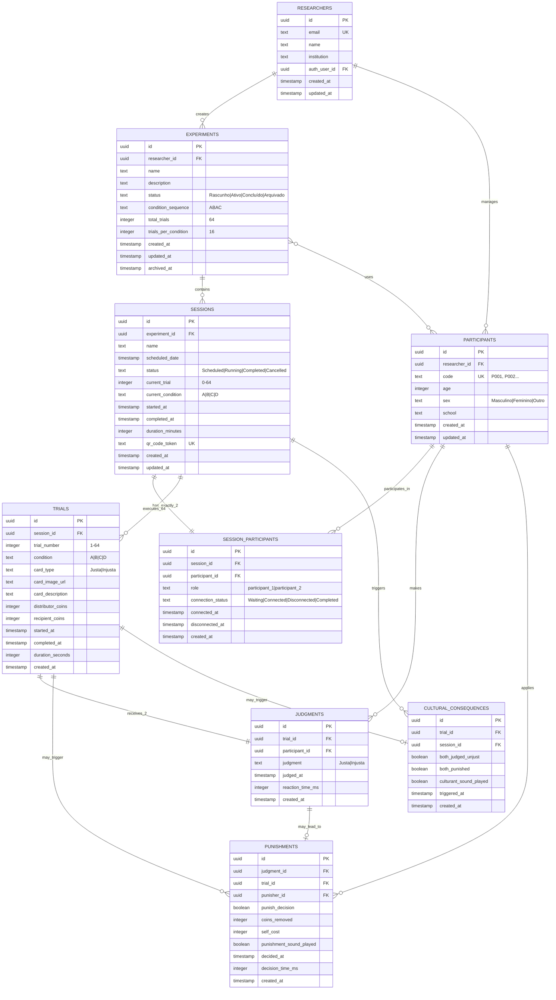
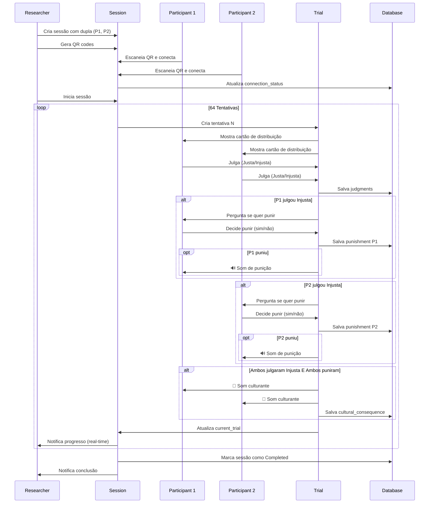
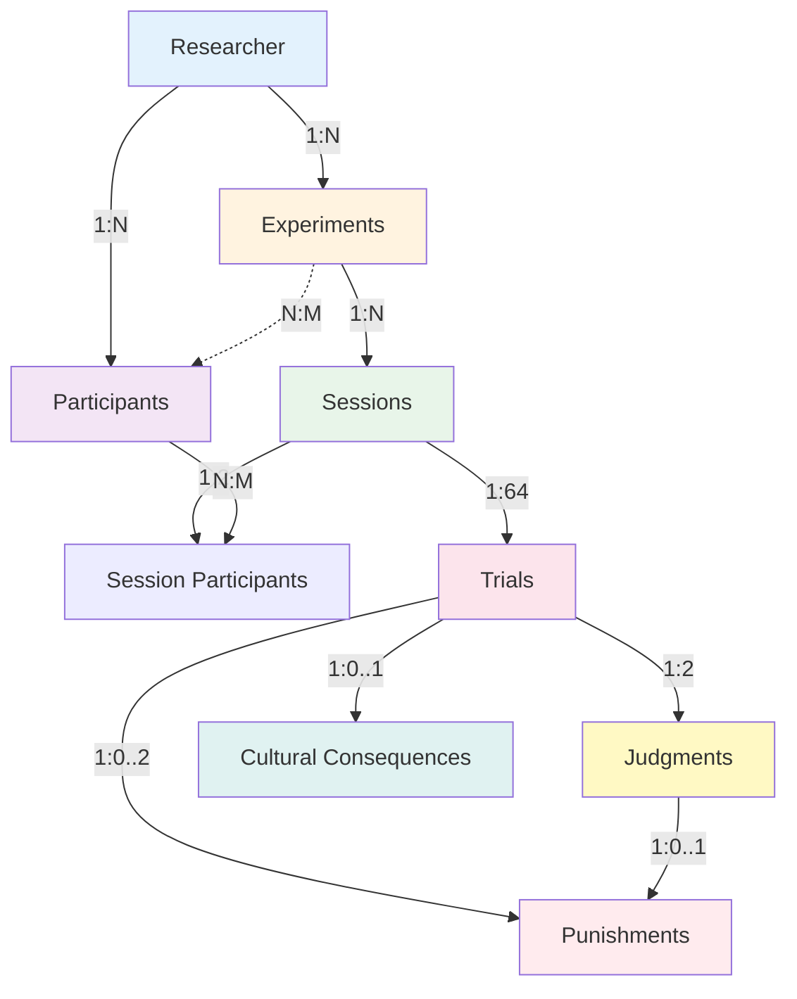
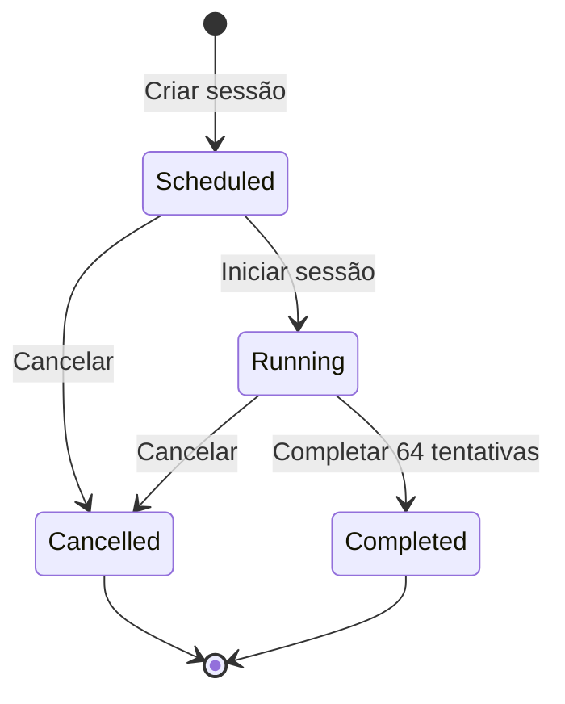
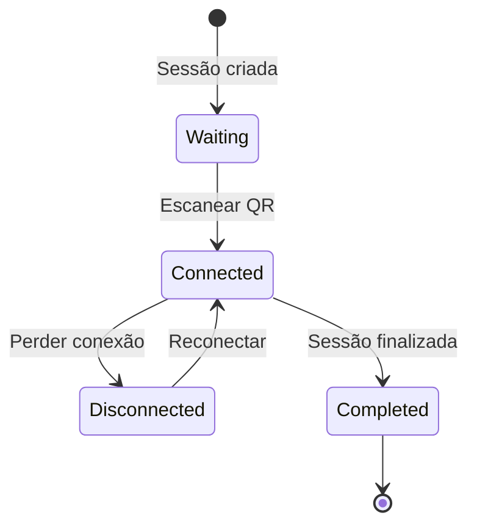
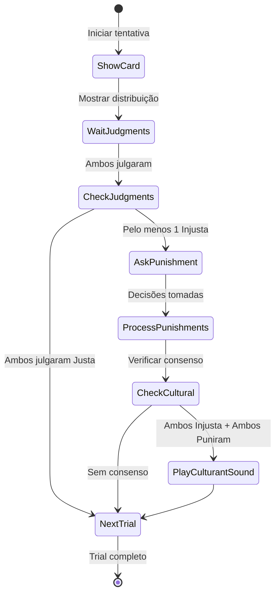
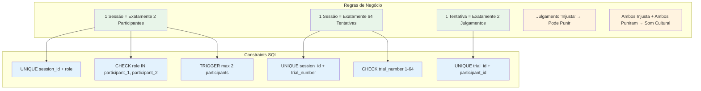
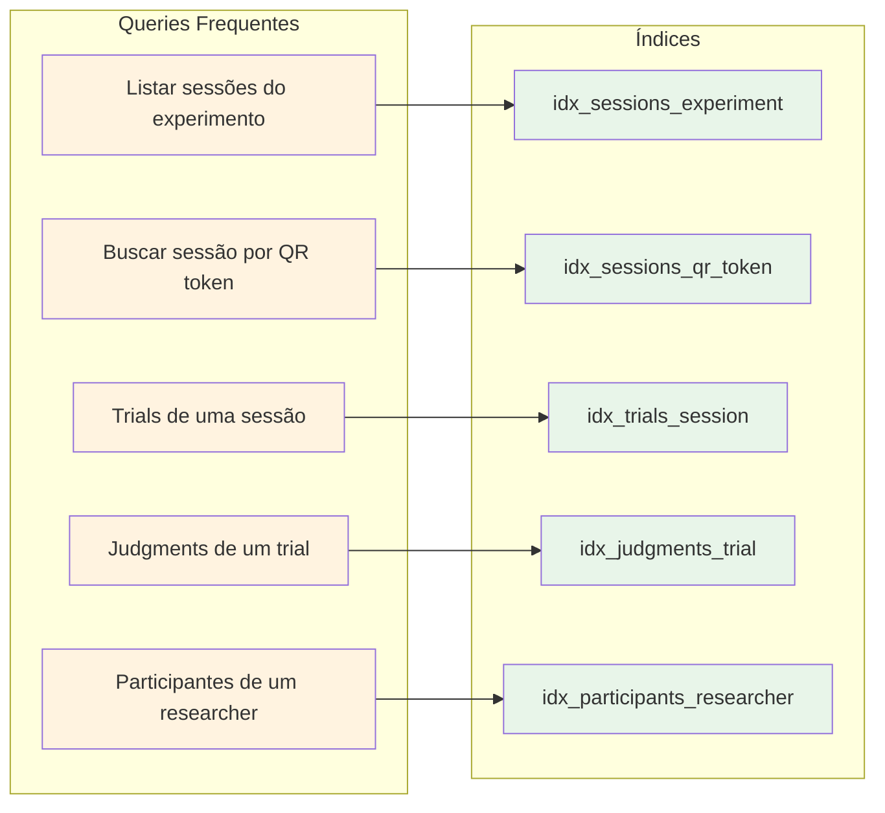

# Diagrama Entity-Relationship (ER)

## Diagrama Completo de Relacionamentos



## Fluxo de Dados Durante uma Sessão



## Cardinalidades Principais



## Hierarquia Visual

```
📊 Sistema de Experimentos
│
├── 👤 Researcher (Pesquisador)
│   │
│   ├── 🔬 Experiment 1
│   │   │
│   │   ├── 📅 Session 1
│   │   │   ├── 👦 Participant 1 (P001)
│   │   │   ├── 👧 Participant 2 (P002)
│   │   │   └── 📋 Trials (1-64)
│   │   │       ├── Trial 1 [Condition A]
│   │   │       │   ├── 👦 P001: Julgamento → Punição?
│   │   │       │   ├── 👧 P002: Julgamento → Punição?
│   │   │       │   └── 🎵 Consequência Cultural?
│   │   │       ├── Trial 2 [Condition A]
│   │   │       │   └── ...
│   │   │       └── ...
│   │   │
│   │   ├── 📅 Session 2
│   │   │   └── ...
│   │   └── ...
│   │
│   ├── 🔬 Experiment 2
│   │   └── ...
│   │
│   └── 👥 Participants Pool (Global)
│       ├── P001 (Ana, 8 anos)
│       ├── P002 (João, 7 anos)
│       ├── P003 (Maria, 9 anos)
│       └── ...
│
└── 👤 Outro Researcher
    └── ...
```

## Estados e Transições

### Estados de Session


### Estados de Participant Connection


### Fluxo de Trial


## Constraints e Regras de Integridade



## Índices Estratégicos



## Performance Considerations

### Query Otimizada: Sessões com Participantes
```sql
-- ❌ RUIM (N+1 queries)
SELECT * FROM sessions WHERE experiment_id = $1;
-- Depois: SELECT * FROM participants WHERE id = ...

-- ✅ BOM (1 query com JOINs)
SELECT 
    s.*,
    json_build_object(
        'participant1', json_build_object('code', p1.code, 'name', p1.name),
        'participant2', json_build_object('code', p2.code, 'name', p2.name)
    ) AS participants
FROM sessions s
JOIN session_participants sp1 ON s.id = sp1.session_id AND sp1.role = 'participant_1'
JOIN session_participants sp2 ON s.id = sp2.session_id AND sp2.role = 'participant_2'
JOIN participants p1 ON sp1.participant_id = p1.id
JOIN participants p2 ON sp2.participant_id = p2.id
WHERE s.experiment_id = $1;
```

### Real-time Subscriptions
```typescript
// Subscribe apenas aos dados necessários
const subscription = supabase
  .channel(`session:${sessionId}`)
  .on(
    'postgres_changes',
    {
      event: '*',
      schema: 'public',
      table: 'trials',
      filter: `session_id=eq.${sessionId}`
    },
    (payload) => {
      // Update UI
    }
  )
  .subscribe();
```

## Tamanho Estimado do Banco

### Por Sessão Completa:
- 1 sessão
- 2 participantes (referências)
- 64 trials
- 128 judgments (2 por trial)
- ~40 punishments (média, depende dos dados)
- ~10 cultural consequences (média)

**Total por sessão**: ~244 registros

### Estimativa de Storage:
- 100 sessões = ~24,400 registros
- Tamanho médio por registro: ~500 bytes
- **Total**: ~12 MB de dados brutos
- Com índices: ~25-30 MB

### Escalabilidade:
- PostgreSQL suporta bilhões de registros
- Supabase free tier: 500 MB
- Supabase pro tier: 8 GB+
- ✅ Sistema comporta facilmente 1000+ sessões

---

**Última Atualização**: 9 de março de 2026
